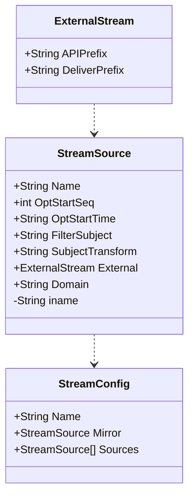

# Stream Source Configuration Model

[//]: # (	Name          string          `json:"name"`)

[//]: # (	OptStartSeq   uint64          `json:"opt_start_seq,omitempty"`)

[//]: # (	OptStartTime  *time.Time      `json:"opt_start_time,omitempty"`)

[//]: # (	FilterSubject string          `json:"filter_subject,omitempty"`)

[//]: # (	External      *ExternalStream `json:"external,omitempty"`)

[//]: # (	Domain        string          `json:"-"`)

[//]: # (	ApiPrefix     string `json:"api"`)

[//]: # (	DeliverPrefix string `json:"deliver"`)

[//]: # (	Mirror       *StreamSource   `json:"mirror,omitempty"`)

[//]: # (	Sources      []*StreamSource `json:"sources,omitempty"`)

